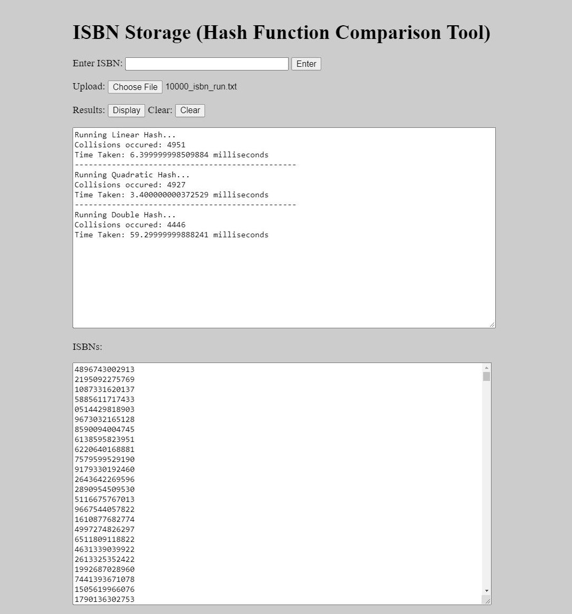

# ISBN Storage Hash Function Comparison Tool (2021))
Uses ISBNs to determine the speed and collision rate of different hash functions in order to see the difference in performance amongst different open addressing systems.
 
 

